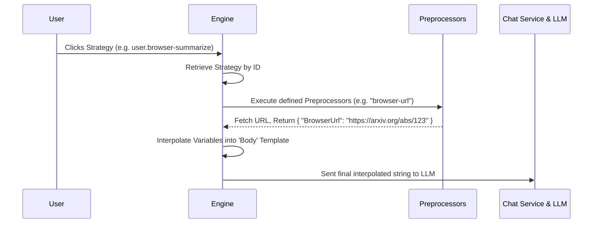

# Preprocessors & Execution Pipeline

The click of a Strategy button does not immediately invoke the Large Language Model (LLM). Instead, the intent goes through an execution pipeline that heavily relies on **Preprocessors**.

## 1. The Preprocessor Concept

While a Strategy establishes the context for *when* you see a button, the user still often needs dynamic information when they click it.

For instance, a "Summarize webpage" Strategy means nothing without the actual text or URL of the page. An "Analyze log file" Strategy needs the exact path of the log file.

Preprocessors are execution-time plugins that run *after* the user intends to execute an action. They inspect the active `StrategyContext`, run code to fetch relevant dynamic OS information, and return a dictionary of variables (Key-Value pairs).

## 2. Execution Pipeline

## 3. The Interpolation Mechanism

A Strategy contains a `Body` (the User Message Template) written in Markdown, which represents the actual prompt sent to the Assistant.

When Preprocessors finish their job, they return a `PreprocessorResult` containing variables. The Engine then resolves Placeholders such as `{BrowserUrl}` in the Strategy's Body template dynamically.

*Why not put this in Condition matching?*
Condition matching happens hundreds of times a second for every single Strategy. Running expensive operations like querying an Excel COM object or hooking into the Browser to fetch the URL is too slow for the UI thread. Preprocessors only fire for the **one** Strategy that the user actually clicked.

## 4. Error Handling and Interruption

If a Preprocessor fails (e.g., the browser closed right before the click, or it cannot find the file), the Preprocessor should throw an exception or return a failed state. The engine intercepts this, notifies the user in the UI, and **halts** the prompt from going to the LLM. This guarantees high-quality, fully populated prompts.
